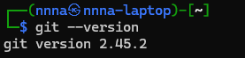
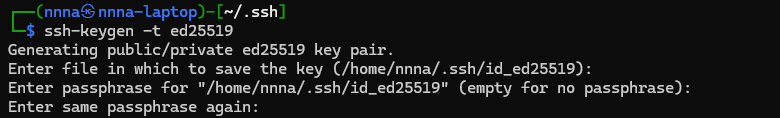
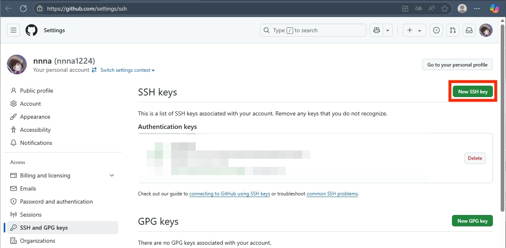
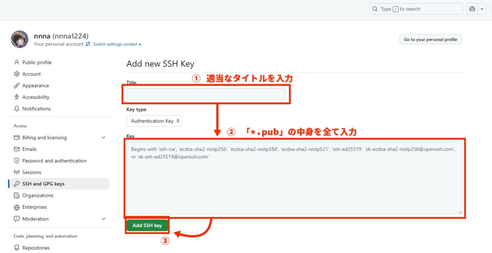

# GitHubにおけるsshの設定方法
## はじめに
GitHubとの通信方法として，ssh以外にもhttpsがある．<br/>
あるいは，GitHubCLIというものも存在するようである．

httpsではパスワード認証が非推奨になり，PAT(パーソナルアクセストークン)が推奨になった．<br/>
しかし，PATは有効期限などがあるし，管理が面倒だなあと個人的に感じてしまう．(これがPATのメリットでもあるのだけれど)

したがって私はsshを設定することにしている．

## 手順
### gitの存在確認
WindowsではWSL(ディストリビューションは何でも構わない)を，macやlinuxではデフォルトのターミナルを開く．<br/>
そこで以下のコマンドを実行し，gitが使用できることを確認する．
```
git --version
```
以下のように，バージョン情報が出力されれば使用可能である．<br/>


インストールされていない場合は，gitのインストール手順を参照．

### ssh鍵の生成
:::caution[注意]
この項で生成される鍵は外部に公開しないこと(少なくとも秘密鍵は絶対に公開してはいけない)．
:::
```
cd ~/.ssh
```
上記のコマンドを実行して，ssh鍵を管理するディレクトリに移動する．

移動したら以下のコマンドを実行して，鍵を生成する．<br/>
※ ここではed25519を使用しているが，より安全なアルゴリズムが出た場合はそちらを使用する．
```
ssh-keygen -t ed25519
```
すると以下のように3回ほど何か聞かれるが，デフォルト設定で構わない場合は3回とも何も入力せずEnterを押せば良い．<br/>

:::info[SSH鍵生成時に設定可能な項目]
鍵の名前を変更したい場合は1回目に任意の名前を入力する．<br/>
パスフレーズを登録したい場合は，2回目と3回目に任意のパスフレーズを入力する(3回目はパスフレーズの確認用)．
:::

### GitHubへのssh鍵の登録
https://github.com/settings/ssh にアクセスして，画面右上の「Add SSH Key」をクリックする．<br/>


以下の画面の「Title」に任意のタイトル，「Key」に公開鍵(「.pub」ファイル)の中身を入れる．<br/>


### sshホストのショートカットを登録
`~/.ssh/config`ファイルに以下の内容を記述する．<br/>
(`~/.ssh/config`ファイルがない場合は作成する．)
```
Host github github.com
    HostName github.com
    IdentityFile ~/.ssh/<作成した鍵のファイル名>
    User git
```

### 接続確認
以下のコマンドを実行して，下の画像のように`Hi <ユーザ名>!`と返ってこれば接続成功である．
```
ssh -T github
```


---

以上でGitHubにおけるSSH鍵の設定が完了した．